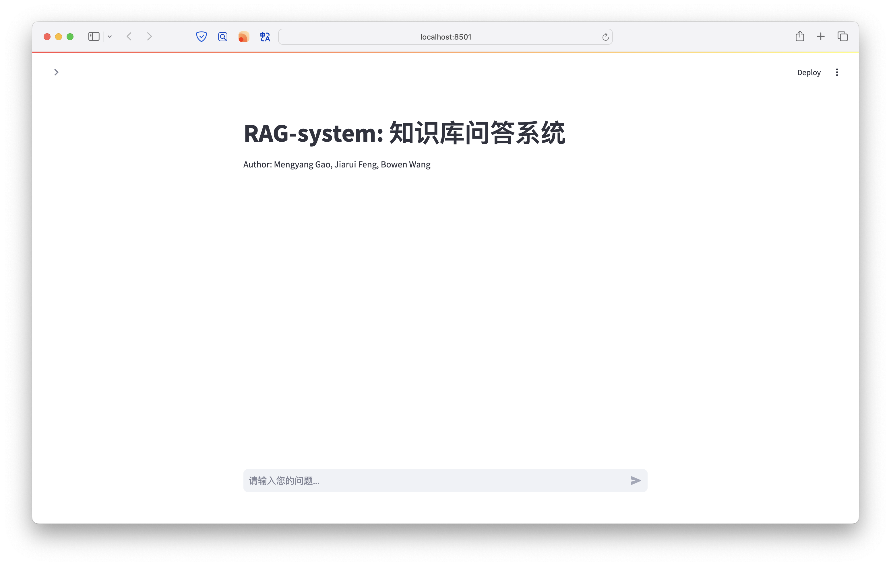
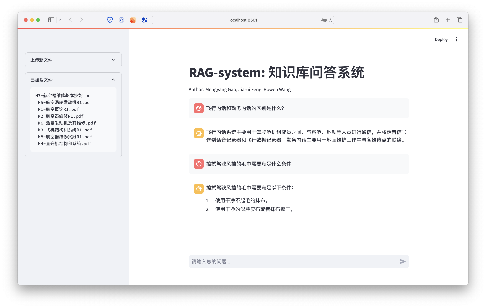

**RAG system**

Using LLM and RAG to build a Q-A system based on specific knowledge. GUI is implemented by Streamlit.

Author: Kevin Stark, Jiarui Feng, Bowen Wang

Date: 2024/06/30

Version: 1.3



# Getting Started

```sh
conda create -n rag-system python=3.10
conda activate rag-system
pip install streamlit, PyPDF2, sentence_transformers, faiss, requests, langchain, dashscope # dashscope for qianwen
```

Put the files to be read under `./documents/` directory manually, or upload them in GUI.

Run it by `streamlit run app.py` (Using default model: gpt) 

Run it by `streamlit run app.py qwen` (Using model: qian wen) 



# File Structure

```
.
├── app.py
├── llmapi.py
├── cache
│   ├── cache_of_documents # Cache of loaded files
│   │   └── cache_of_documents.json
│   └── cache_of_embeddings # Cache of embeddings files
│   │   ├── cache_of_embeddings_batch_1.npy
│   │   ├── cache_of_embeddings_batch_2.npy
│   │   ├── etc.
│       └── cache_of_embeddings.npy
├── documents # Put the files manually here, or upload them in GUI.
│   ├── documents_1.pdf
│   └── etc.
└── README.md
```

# Developing Log

v1.3: 更新缓存检查机制和命名规范；调整GUI，增加侧边栏，因为随着交互内容增加，想上传新文件/查看已上传文件信息要翻很久，如果有侧边栏/冻结首栏比较好。embeddings的缓存增量更新还没做。

v1.2: 添加上传文件功能。  

v1.1: 添加多个注释方便阅读；优化函数preprocess_documents名改为split_text_chunks；在GUI里增加各步骤执行成功的反馈；考虑添加local llm；Streamlit里对'''多行注释'''好像有些独特用法，st.markdown (TD)  
v1.0: 增加文档载入和向量嵌入的缓存机制；添加向量嵌入的批处理操作避免内存占用过大；暂时没有添加“上传文档”按钮，没有做文件更新缓存变动检查。
